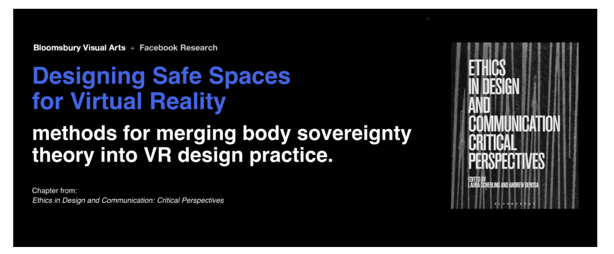
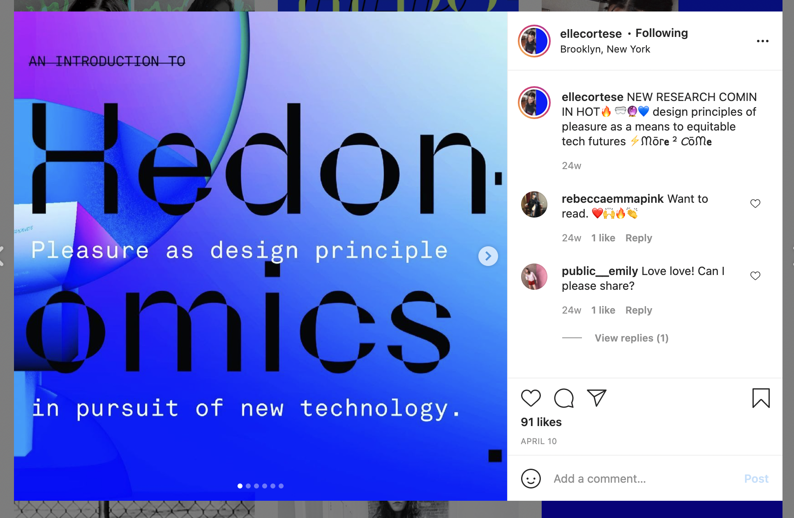

For this week I did research on VR and found an artist named Michelle Cortese (https://www.instagram.com/ellecortese/). She works on designing safe spaces in virtual reality (http://www.ellecor.com/?p=354). I thought her work was interesting because I hadn't really considered the implications of safety, inclusiivity, etc. in the virtual world. I guess because it's not a common use in daily life that I haven't really given it much thought, especially the real consequences surrounding taking someone into a completely different world. It was helpful to hear and see her perspective on this, as I am considering using VR or augmented reality as apart of making my project immersive. I haven't connected the dots to how I can take an educational project inciting discussion into a virtual world, nor have I answered questions of feasibility yet, but doing this research is helping me gather a better foundation on the technology. As a part of my class, Desinging the Future, I am working on a presentation on Virtual Reality so I think that will also help me do more research.

