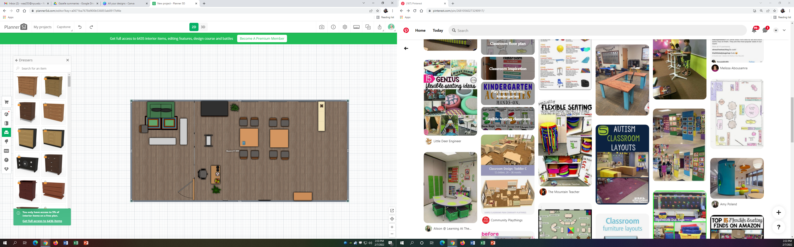

From my meeting with Steven I was able to get a better idea of the room I wanted. He walked me through 045, the Black box, and I think the space will fit well with what I am trying to do. We also took a lot at the items in prop storage. I took a lot of photos and believe the items will be vary useful in creating the right enviornment in my escape room. Looking at everything was a little overwhelming since there was so many things and the space was quite large. However, it did get me excited to start working on a mood board and floor plan that could help me better visualize the space I am trying to create.

I started working on the floor plan and mood board this week as well. I'm experimenting with a few options for how to set up the room. I am also exploring different ways to create the illusion of two rooms. I think it would take too much to actually build 2 rooms and would be too time consuming for the purpose of my project. I'm thus looking at ways to perhaps organize furniture, manipulate light, and/or use partitions to make it clear that its a separate room. The next step would be to finalize my initial ideas and share with Steven to get a better idea of what is feasible. I hope to be able to do this by the end of the week. 

I am also in conversation with Jon Bonner about booking room 045 and meeting with him on Thursday to discuss my project and needs. 

