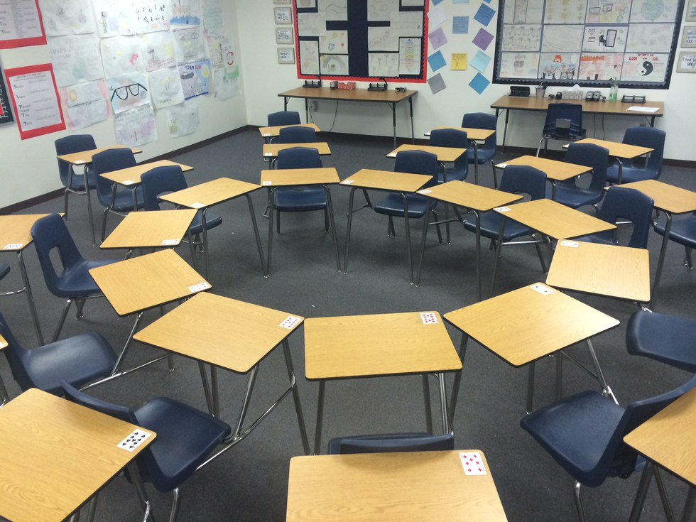
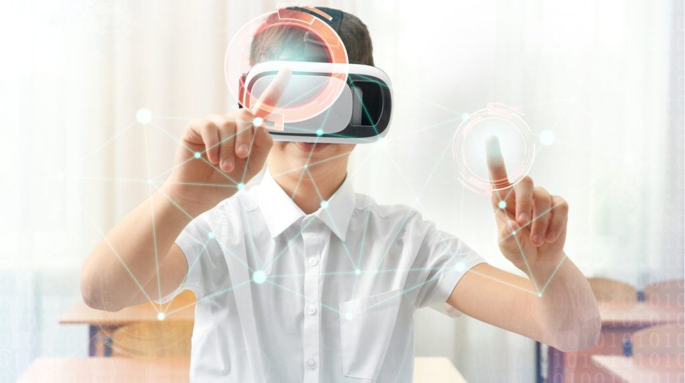

Response to feedback from blog 2: I have been thinking about the audience question posed to me. I think I want to focus on the high school experience and open it up to anyone who has completed high school since I would like the project to be a reflective journey. I spoke with my advisor (Michael Shiloh) and we talked about interviewing or talking with educators, students, and anyone related to the educational field to get their insights or views. I think having more opinions will better help me create a project that is relatble to the audience I'm trying to reach.

Third blog:
This week I've thought a lot about aspects I want to incorpate in the tangible fruition of my project. I've had a lot of ideas over the past few weeks and I wanted to start thinking about something a bit more concrete. I think for the project content I made a list of things I think should have been taught in school to better prepare us for the world/society, these include financial literacy, cultural competency, and more exposure. To expand on the exposure point, I think schools shouldn't limit students to the basic math, history, science, but also expose them to technology, media, and art (not just the traditional painting and drawing). The goal of education (which I've been trying to grapple with as well) in my opinion should be to expose students to whats out there in terms of people, cultures, jobs, interests, passions. Obviously you can't expose them to everything but my showing students there is more out there I believe that will breed more curiosity to also explore on their own.

The ideas above I realize are theories not backed by evidence. I'm currently working on reaching out to people in the educational department at NYU and looking into literature on why the school/educational system is the way it is right now. My project ultimatley I want to be diverse enough to allow different backgrounds to reflect on their education, but I figured I'd start with the American systme to get a better understanding on why my personal education was structured the way it was. I think this is important because it'll help me compare the original goal with its success or results in students now, and the potential and probable need to change it. I also want to talk with teachers and professors to get their thoughts on how the education system is currently and what they'd change, given they are in a different position than students. 

Going back to the realization of my project. I've been look at socratic dialogues/discussions as an interesting way to teach but also engage students in different topics by getting the to interact with each other. I think I'd like to incorporate an element like that that encourages discourse and reflection through the conversations you may have with other students. I also was thinking about the rapid development of technology and its uses in the classroom. Specifically, I've been looking at uses of VR in immersing people in other realities. I'm not sure how feasible this is but finding a way to immerse audience members in virtual classroom where they can control what they would change or observe a reality with specific settings they choose would be an interesting way to encourage dialogue while also giving them a visual representaiton they can refer to. 

